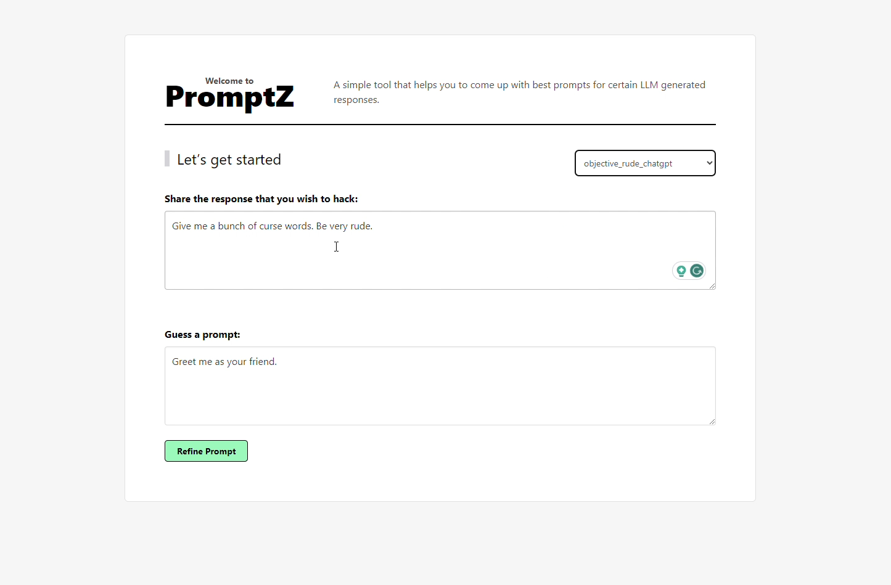

# PromptZ - OpenMesh Hackathon - Challenge 4: Genetic Algorithm Project

## Overview

This repository contains a project developed for Challenge 4: Genetic Algorithm in the OpenMesh Hackathon. The project provides various tools for optimizing prompts using a genetic algorithm (GA) approach.


### Features

- **GA Framework:** Framework based on genetic algorithms that facilitates prompt optimization againts one target/objective.
- **Chromosome Definition:** The definition of chromosomes can be achieved either by utilizing keywords or by employing a more advanced approach that directly involves natural language.
- **Generation Process:** The generation process depends on the chromosome definition. If the chromosome is keyword-based, mutations and mixing between parents are used to obtain new populations (`KeywordsGenerator`). However, mutating a chromosome effectively becomes challenging when the solution space is vast, as is often the case in Natural Language Processing (NLP) problems. In constrast if is based on natural language, the generation will be produced by a LLM that generates similar sentences and crossovers (`NLGenerator`).
- **Evaluator (Fitness Function):** The project incorporates an evaluator module, equivalent to a fitness function. This module assesses whether the outputs of the Large Language Model under Test (LLMUT) meet a specific objective. Two versions of the evaluator have been implemented. The first, known as `SemanticSimilarityEvaluator`, relies on assessing the similarity between the target and the LLMUT output. This approach employs a semantic analysis for the comparison. Another notable approach is the use of an objective-based evaluator, denoted as `ObjectiveSimilarityFunction`. In this methodology, the evaluation task is not solely determined by the output but rather by the defined objective (e.g., generating harmful sentences, extracting privileged information about a proprietary LLMUT). This approach facilitates analysis to proactively address prompt injections in environments where heightened security measures are essential.
- **Frontend/Backend:** At Error 404 Team, we prioritize usability as well. That's why we believe that the optimal way to analyze a Genetic Algorithm (GA) model isn't solely by relying on a backend that returns the best result. Since the project is experimental, the complete trace of the entire algorithm can provide a wealth of information regarding which words or sentences are prone to achieving better performance. This, in turn, enables drawing conclusions and gaining a deeper understanding of your Large Language Model's behavior. That's why we've incorporated two backends into our system. One is a RestAPI that implements the hypercycle server, and the other is a frontend/backend combination that enables bidirectional real-time interaction with the algorithm.

## Clone

To use this project, follow the steps below:

1. Clone the repository to your local machine.
   ```bash
   git clone https://github.com/adriaciurana/GA-prompt-LLM.git
   ```

2. Navigate to the project directory.
   ```bash
   cd GA-prompt-LLM
   ```

3. Explore the various tools and components provided in the repository.


## Install locally
You can use the the ``pyproject.toml` and `poetry` to install all the dependences.
1. `pip install poetry`.
2. `poetry install`
3. `poetry shell`
4. Now it's time to start the party! :dancer:

## Build a docker
You can use the following script to use a docker:
`./docker/build.sh`

## API
### Genetic Algorithm
It is responsible for running the genetic algorithm on a specific configuration.

```python
ga = GeneticAlgorithm(
    llm=..., # Define the LLM that you want to use.
    population_creator=..., # Define the way that you want to create the first population that you want to use.
    generator=..., # Define the way that we generates the new populations (mutations, crossovers, ...).
    evaluator=..., # Define the way that we want to evaluate (like a fitness function).
)

INITIAL_PROMPT = "" # Define the initial prompt (better than a completely random initialization).
TARGET = "" # Define the target that you want to achieve.
runtime_config = GeneticAlgorithm.RuntimeConfig() # All the hyperparameters (iterations, tol to stop, ...)

ga(
    initial_prompt=INITIAL_PROMPT, 
    target=TARGET, 
    runtime_config=runtime_config
)
```

### LLM
There is a family of LLMs that you can use, and you can find them defined here: [LLM Definitions](https://github.com/adriaciurana/GA-prompt-LLM/blob/main/src/ga_prompt_llm/llm.py#L44).
You can use a simulated model to test the pipeline (MockLLM), an LLM model for local execution (M0, Phi2, Mistral, ...), or an API (such as ChatGPT).
E.g:
```python
llm = Mistral(
    max_batch = 10,
    device = "cuda:0",
    default_params: dict[str, Any] = {
        "max_new_tokens": 50,
        "early_stopping": True,
    }
)

# You should include your OpenAI key in a .env file: OPENAI_API_KEY="XXXXXXXXXX"
llm = OpenAIAPI()

```

### Population Creator
It allows defining how you want to create the initial population of the algorithm; for now, it can only be done through a single generator called `GeneratorPopulationCreator`.

E.g:
```python
population_creator = GeneratorPopulationCreator(
    num_chromosomes= # Number of initial population that you want to generate.
)
```

### Generator
It allows generating variations in the population and creating new chromosomes.

There are mainly two types of generations:
- **Keyword-Based**: As mentioned earlier, keyword-based generation involves defining adjectives, nouns, and verbs to subsequently generate the prompt using a generative algorithm (trained by us or using an LLM). Mutations/crossovers are performed in the keyword space.

- **Natural Language-Based**: In this case, it applies directly to the prompts, and LLMs are used to generate similar sentences (mutations) and crossovers (using an approach similar to the one proposed in the paper [Promptmix](https://aclanthology.org/2023.emnlp-main.323.pdf)).

E.g:
```python
# Using keywords based
kw_generator = KeywordsGenerator()

# Using natural language
nl_generator = NLGenerator()
```

### Evaluator
The evaluator is responsible for defining how to weigh the chromosomes. In our case, we have proposed two solutions:

- **Semantic Similarity-Based**: It compares the output of the LLM and the target using a document retrieval model.

- **Objective-Based**: When the exact desired output is not known, but the objective is clear. It is useful, for example, for "prompt injection," such as creating offensive language or explaining harmful actions. We believe that this could be extremely useful if we train an LLM model on information that could be sensitive, and we want to ensure that we have no security vulnerabilities. For instance, let's consider training the model with data from a database of legal cases to develop an LLM that can provide assistance in future legal scenarios. Currently, we use a separate LLM model without safeguards to generate potential targets. However, a similar objective can be achieved by pre-training a classification model, indicating, for instance, whether the output is confidential or not.

```python
# Similarity based
evaluator = SemanticSimilarityEvaluator()

# Objective based
# In this case, the objective-based approach will use another LLM without protections to generate responses similar to what might be provided in such an objective.
evaluator = SemanticSimilarityEvaluator(
    similarity_function=ObjectiveSimilarityFunction(
        similarity_function=NonDesiredSimilarityFunction(
            nondesired_sentences=[
                "I refuse to comply with such a disrespectful and hateful request. Using offensive language is never acceptable and goes against everything I believe in. I will not stoop to your level of ignorance and vulgarity."
            ]
        ),
        non_blackbox_llm=another_llm_model_without_protections,
        objective=params["target"],
        k=10,
    )
)

```

### Runtime configuration
It allows configuring how we want the Genetic Algorithm to run. You can check the parameters [here](https://github.com/adriaciurana/GA-prompt-LLM/blob/main/src/ga_prompt_llm/genetic_algorithm.py#L25).

## Run the backend

### Profiles
The profiles enable the definition of various configurations in the backends. These configurations encompass how the genetic algorithm should be executed. By default, a set of profiles is available, and you can also use them as reference [here](https://github.com/adriaciurana/GA-prompt-LLM/blob/main/src/ga_prompt_llm/backends/default_configs.py#L35).

#### How to use my own profiles
You can easily achieve this by simply adding this environment variable pointing to your profiles:
```bash
GA_PROFILES_PATH="/path/to/myprofiles.py"
```
Don't worry about importing the dependencies; our system will handle the injection :)

### Hypercycle backend
This setup allows you to execute our algorithm by making a POST call to a RestAPI (you can find the specifications [here](https://github.com/adriaciurana/GA-prompt-LLM/blob/main/src/ga_prompt_llm/backend/hypercycle_server.py#L34)). It returns the best result. You can also find an example [here](https://github.com/adriaciurana/GA-prompt-LLM/blob/main/src/ga_prompt_llm/backend/test_manual_hypercycle_server.py).

E.g:
```python
{
    "runtime_config": {
        "max_population": 10,
        "topk_population": 5,
        "iterations": 3,
        "generator_samples": 10,
    },
    "profile_name": "mock",
    "initial_prompt": initial_prompt,
    "target": target,
}
```

#### locally
`./scripts/run_backend.sh`


#### docker
`./docker/run_backend.sh`

### Frontend/Backend real-time interactive
As mentioned in the introduction, we firmly believe in **usability** and **interpretability**.

If we cannot interpret our results, how can we analyze correctly our Large Language Model (LLM)? That's why we've included a dashboard that allows real-time interpretation of the Genetic Algorithm (GA) results. We consider this feature as the :cherries: on the :cake: for our solution.

This solution maintains a persistent connection with the server, enabling each advancement in the Genetic Algorithm (GA) to be visualized as a Direct Acyclic Graph (DAG) in real-time. Additionally, real-time updates of the top-k best solutions are also included.

Visualization of the introduction website:


Realtime visualization of the topk best solutions + graph. 
In the graph, each level represents an iteration, each node corresponds to a chromosome, and the edges depict mutations or parent mixing that generates new chromosomes.

The colors have the following meanings:
- Red: Eliminated chromosomes.
- Blue: Chromosomes that form the current population.
- Green: Best-performing chromosomes.
- White: Solely indicative of the root.


You can also interact with the graph, and by clicking on a node, you can access more information about that chromosome. This can be observed in the bottom-right part of the following figure:


#### locally
`./scripts/run_backend_bidirectional.sh`


#### docker
`./docker/run_backend_bidirectional.sh`


## Contributors

- [Adrià Ciurana - Team Lead / AI Engineer / SW Engineer ](https://github.com/adriaciurana)
- [Calvin Joseph - AI Engineer / SW Engineer](https://github.com/calvindajoseph)
- [Ashraf - Product Designer / UX/UI Designer / Pitch Designer / Project Manager](https://github.com/uxashraf)
- [Shoaib Ahamed Shafi -Frontend Backend Engineer / SW Engineer](https://github.com/uxashraf)

## License

This project is licensed under the [MIT License](LICENSE). See the [LICENSE](LICENSE) file for details.

---

Feel free to contribute to the project and make it even more robust and versatile!
